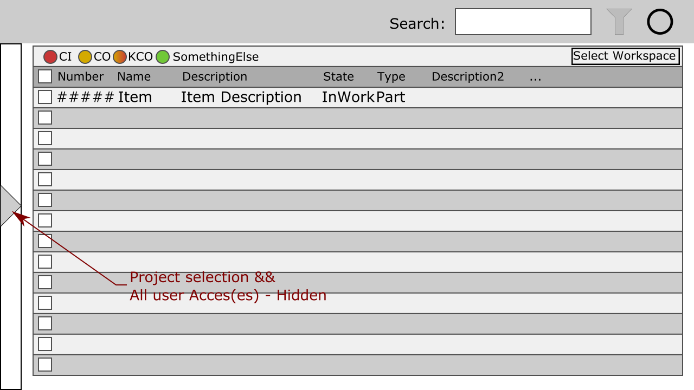
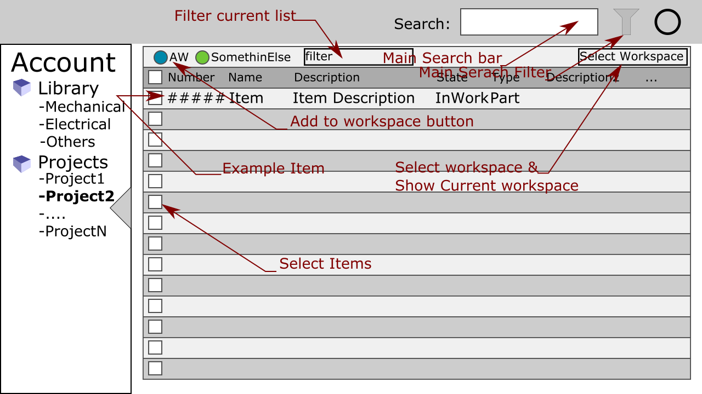
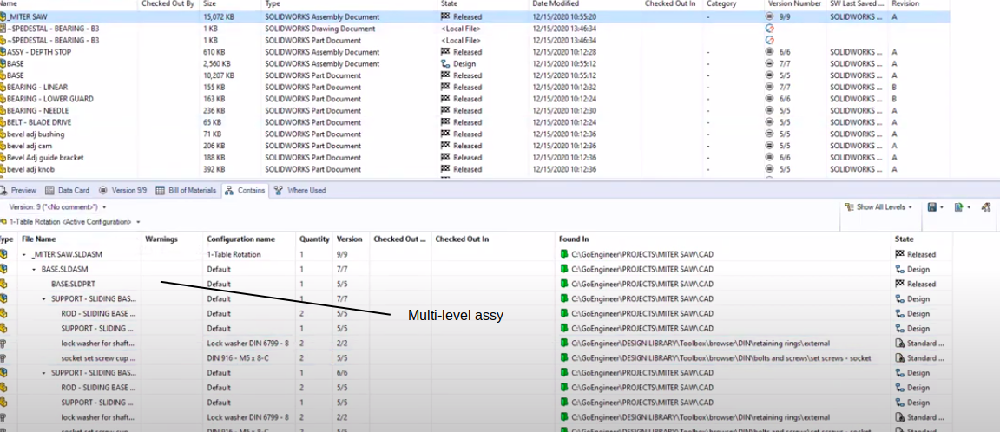
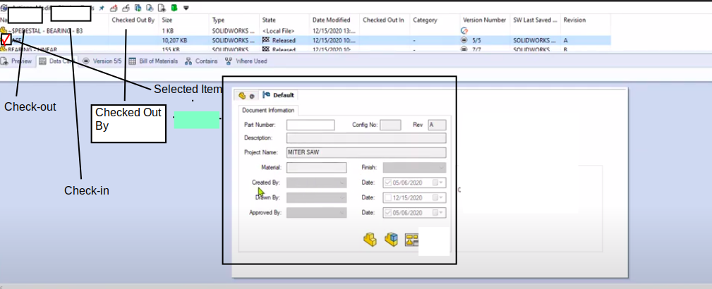
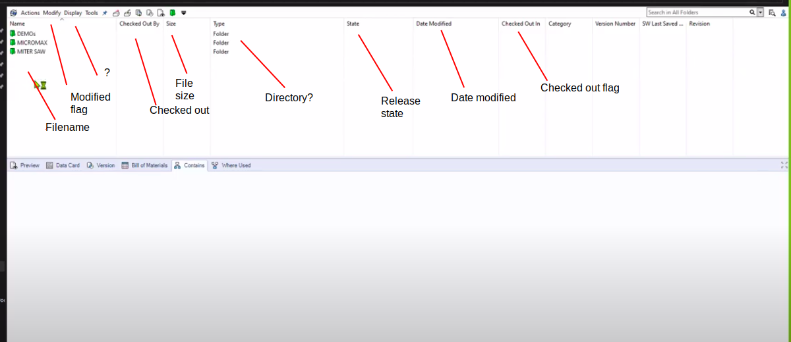
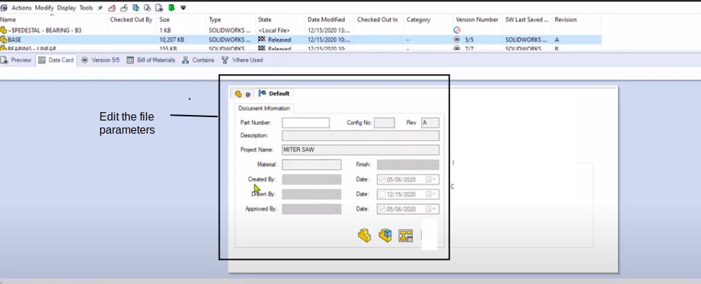

# FreePDM
***Concept Of Design***

## Ui functions

### Introduction

There are already some interfacing figures (From Solid Works). This the links to the files(in alphabetic order) are:

It is the goal to create a( discussion how to create a) set of logic workflows how to handle some activities.
Also how to different activities / workflows interact.

### Assumptions

- The PMD should take in rest as few as possible screen space
- It should be easy to open the PDM system
- The PDM system is well integrated in FC
- The interaction inside FreeCAD see [05-UIInteractionFC](05-UIInteractionFC.md)

### Workflow 1 <!-- Project view -->

In the Project it is possible to select current working project (Specially when workspaces are not implemented).
Another feature about this is that you can see to what projects you have reading access.
The project bar is hide-able.

### questions / Comments 1

### Workflow 2 <!-- Workspace view -->

The view where the most activity is done is the _Workspace_ view.
Here are all files listed that are in your working directory.
When workspaces are available it is possible to create multiple workspaces from the same project or assembly. For example when you need to test something for a future change without breaking current structure.  
In this view all activities that are done happens here( at least if not working from FC).
The image is not complete.
A more complete list is stated below:

- Check-in
- Check-out
- undo check-out
- Check-in && check-out
- mark for revision, mark for work (revised and needs an edit again), ...
- set state (revision, obsolete, in work, ...)

Other activities

- Create workspace
  - Make copy of workspace (?)
  - Delete workspace
- Select workspace

### questions / Comments 2

Beside these functions there should be thought about additional features as showing:

- an item is changed (while you don't have write access. So you can request write access)
- There is a newer version on the server
- When the main assembly is added (by a [Search action](#workflow-3)) all lower level items can be added

### Workflow 3 <!-- Search view -->

Searching is important specially when working on bigger projects or when more (CAD-)data is available.
This is the place where item(s) are added to the workspace.

What type of search options are needed:

- name
- description
- keywords

There are two types of filtering.
Pre filtering and post filtering.
In pre-filtering you search for a part so all assemblees with the same search term are ignored.
After the search operation another filtering can applied.
In this case it filters in the previous find items. 
A set of filter examples are:

- project
- date / year
- number
- ...

#### questions / Comments 3

- Check if adding will be possible in (database )search

### Workflow 4 <!-- Item view -->

The last view is the item information.
Basically here is all information from the database shown.  
This window can be accessed from the search view AND from the workspace view.

#### questions / Comments 4

### Images from SW

- 
- 
- 
- 

[<< Previous Chapter](03-RevisionProcedures.md) | [Content Table](README.md) | [Next Chapter >>](05-UIInteractionFC.md)
